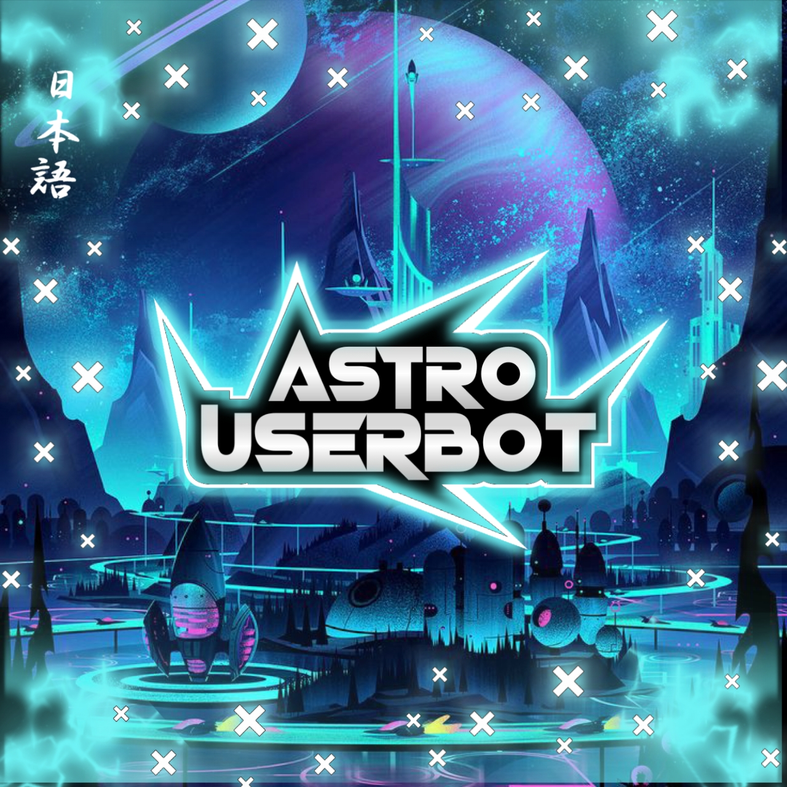
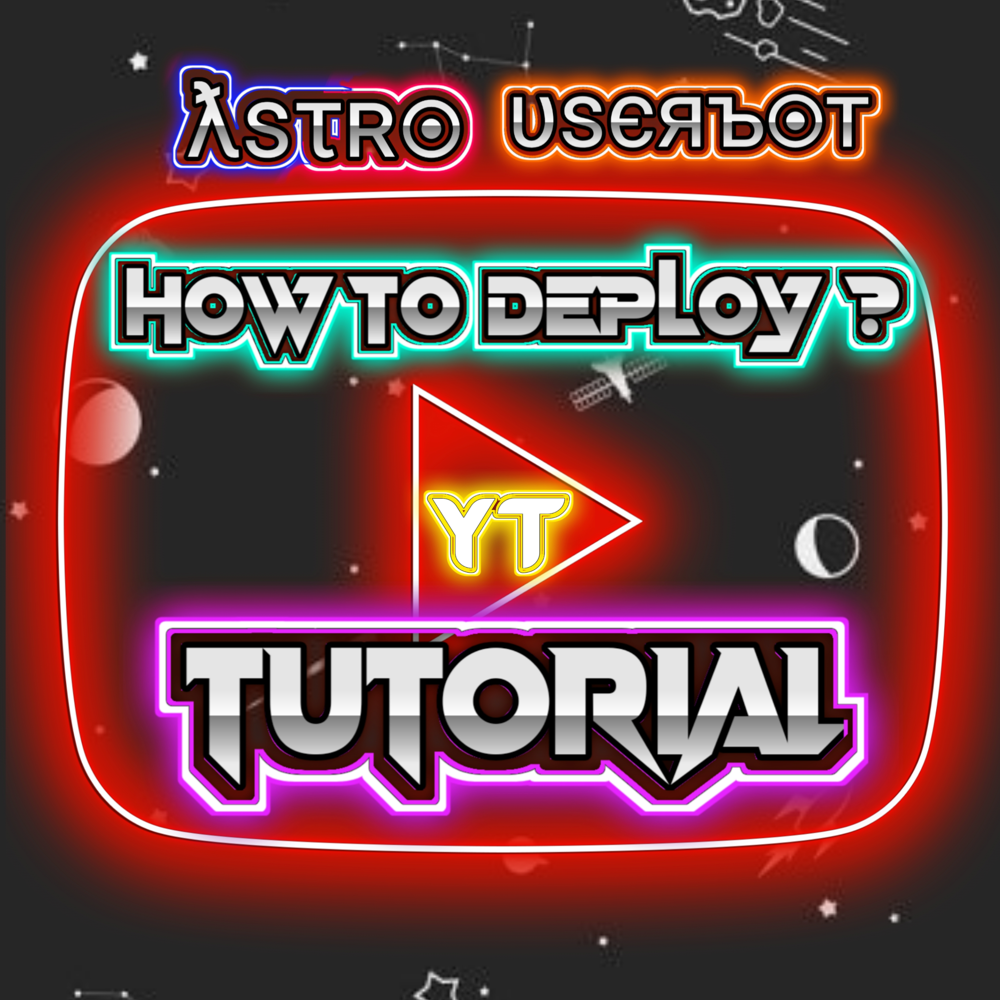

<p align="center">
   
   <a href="https://github.com/PsychoBots/Astro-UB">
      
      </a>
      <br>
   <b>ƛsτʀ๏ υsєяъ๏т</b><br>
   <i>ƬӇЄ ƑƲƬƲƦƖṠƬƖƇ ƲƁ</i>
</p>

<b><h4> THIS IS A POWNERFULL, USEFULL TELETHON USERBOT</h4></b>
<br>
<i><h3> 𝚂𝚃𝙰𝚃𝚄𝚂 𝙾𝙵 𝙱𝙾𝚃 </h3></i>
<br>
[](https://github.com/PsychoBots/Astro-UB)
[]( https://github.com/PsychoBots/Astro-UB#copyright--license)
[]( https://github.com/PsychoBots/Astro-UB/stargazers)
[](https://www.python.org/downloads/release/python-360/)
[]( https://github.com/PsychoBots/Astro-UB/network/members)
[]( https://github.com/PsychoBots/Astro-UB/issues)
[]( https://github.com/PsychoBots/Astro-UB/issues?q=is:closed)
[]( https://github.com/PsychoBots/Astro-UB/pulls)
[](https://github.com/PsychoBots/Astro-UB/pulls?q=is:closed)

<br>

## Why to Choose Astro🌌UserBot🤔?
```
• 𝙏𝙃𝙄𝙎 𝙄𝙎 𝙑𝙀𝙍𝙔 𝙀𝘼𝙎𝙔 𝙏𝙊 𝘿𝙀𝙋𝙇𝙊𝙔 ✨
• 𝘿𝙀𝙋𝙇𝙊𝙔𝘼𝘽𝙇𝙀 𝙏𝙊 𝙃𝙀𝙍𝙊𝙆𝙐✓
• 𝙂𝙀𝙏 𝙍𝙀𝙂𝙐𝙇𝘼𝙍 𝙐𝙋𝘿𝘼𝙏𝙀𝙎✓
• 𝙒𝙄𝙏𝙃 𝙇𝙊𝙏𝙎 𝙊𝙁 𝙐𝙎𝙀𝙁𝙐𝙇𝙇 𝙋𝙇𝙐𝙂𝙄𝙉𝙎🤩
• 𝙒𝙄𝙏𝙃 𝙁𝙐𝙇𝙇 𝙎𝙀𝘾𝙐𝙍𝙀 𝙋𝙈_𝙎𝙀𝘾𝙐𝙍𝙄𝙏𝙔🔐
• 100% 𝘾𝙐𝙎𝙏𝙊𝙈𝙄𝙎𝘼𝘽𝙇𝙀 💠
• 𝙋𝙍𝙊 𝘼𝙎𝙎𝙄𝙎𝙏𝘼𝙉𝙏 𝙈𝘼𝙉𝘼𝙂𝙀𝙍 👥
• 𝙔𝙊𝙐 𝘾𝘼𝙉 𝘾𝙐𝙎𝙏𝙊𝙈𝙄𝙎𝙀 𝙇𝙊𝙏𝙎 𝙊𝙁 𝙏𝙃𝙄𝙉𝙂𝙎
  𝙒𝙄𝙏𝙃 𝘼𝙎𝙎𝙄𝙎𝙏𝘼𝙉𝙏🛂

• ||𝙁𝙐𝙇𝙇 𝙎𝙐𝙋𝙋𝙊𝙍𝙏 𝙁𝙍𝙊𝙈 𝘼𝙎𝙏𝙍𝙊 𝙎𝙐𝙋𝙋𝙊𝙍𝙏 
    𝙄𝙁 𝙂𝙀𝙏𝙎 𝙀𝙍𝙍𝙊𝙍𝙎🫂||
```
# <i><b> sᴜᴘᴘ๏ʀᴛ </b></i>

<a href="https://telegram.me/Astro_UserBot" target="_blank"></a>

<a href="https://telegram.me/Astro_HelpChat" target="_blank"></a>
# 𝗗𝗘𝗣𝗟𝗢𝗬𝗠𝗘𝗡𝗧
<a href="https://heroku.com/deploy?template=https://github.com/PsychoBots/Astro-UB" target="_blank"></a>
    
<details><summary> <h1 align="left">𝙂𝙀𝙏 𝘼𝙇𝙇 𝙍𝙀𝙌𝙐𝙄𝙍𝙀𝙈𝙀𝙉𝙏𝙎</h1> </summary>

## 𝐀𝐏𝐈_𝐈𝐃 - 𝐇𝐀𝐒𝐇
   </p><p align="centre"><a href="https://my.telegram.org"> </a> 
      </p><p align="centre"><a href="https://t.me/Api_ScrapperRoBot"> </a> 
      
## 𝐒𝐓𝐑𝐈𝐍𝐆 𝐒𝐄𝐒𝐒𝐈𝐎𝐍 
   <a href="https://replit.com/@loverboyXD/SESSIONSTRING-GEN#main.py" target="_blank"></a>
   
## 𝐏𝐑𝐈𝐕𝐀𝐓𝐄 𝐆𝐑𝐎𝐔𝐏 𝐈𝐃
<a href="https://telegra.ph/HOW-TO-GET-PRIVATE-GROUP-ID-08-10" target="_blank"></a>

## 𝐎𝐖𝐍𝐄𝐑 𝐈𝐃
<a href="https://t.me/Botfather" target="_blank"></a>

## 𝐇𝐄𝐑𝐎𝐊𝐔 𝐀𝐏𝐈 𝐊𝐄𝐘
<a href="https://dashboard.heroku.com/account" target="_blank"></a>

## 𝐁𝐎𝐓 𝐓𝐎𝐊𝐄𝐍 - 𝐔𝐒𝐄𝐑𝐍𝐀𝐌𝐄
<a href="https://t.me/Botfather" target="_blank"></a>

<a href="https://t.me/Botfather" target="_blank"></a>

</details>

# 

<details><summary><h2 align="left">•𝙃𝙊𝙎𝙏 𝘼𝙎𝙏𝙍𝙊 𝙊𝙉 𝙑𝙋𝙎❄️•</h2></summary>

### 𝙏𝙊 𝙃𝙊𝙎𝙏 𝘼𝙎𝙏𝙍𝙊 𝙊𝙉 𝙑𝙋𝙎/𝙏𝙀𝙍𝙈𝙐𝙓

### Follow The Commands⚙️

```

pkg update && pkg upgrage
pkg install git 
# git clone 
git clone https://github.com/PsychoBots/Astro-UB
cd Astro-UB
# create Virtualenv 
virtualenv -p /usr/bin/python3 venv
. ./venv/bin/activate
# install requirements 
pip install -r requirements.txt
# <Create local_config.py with variables as given below>
python3 -m AstroUB.py

```
### Mandatory Vars 🔌

```

•𝙊𝙉𝙇𝙔 𝙁𝙀𝙒 𝙏𝙃𝙄𝙉𝙂𝙎 𝙍𝙀𝙌𝙐𝙄𝙍𝙀𝘿•
[+] API_ID: enter Your API_ID
[+] API_HASH: enter Your API_HASH
[+] STRING_SESSION: Your String Session
[+] PRIVATE_GROUP_ID: Your Private_Group_id it must starts from -100

```
</details>


# YouTube Tutorial 📽️
### Click On Picture Below To watch YouTube Tutorial..!

<p align="center">
   
   <a href="https://github.com/PsychoBots/Astro-UB">
      
      </a>
      <br>
   <b><i>ƜƛƬƇӇ</i></b><br>
   <b><i>ƳƠƲƬƲƁЄ ƔƖƊЄƠ</i></b>
</p>

## 𝙳𝙴𝚅𝙴𝙻𝙿𝙾𝙴𝚁𝚂

